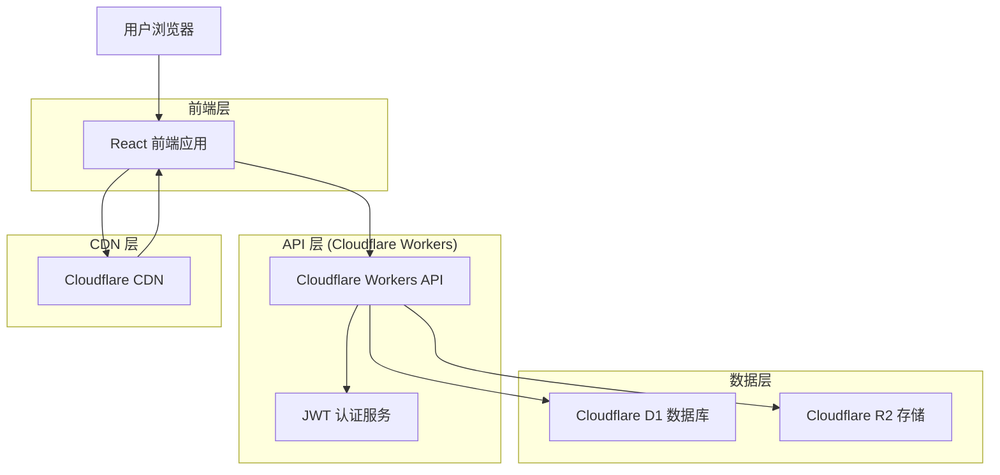
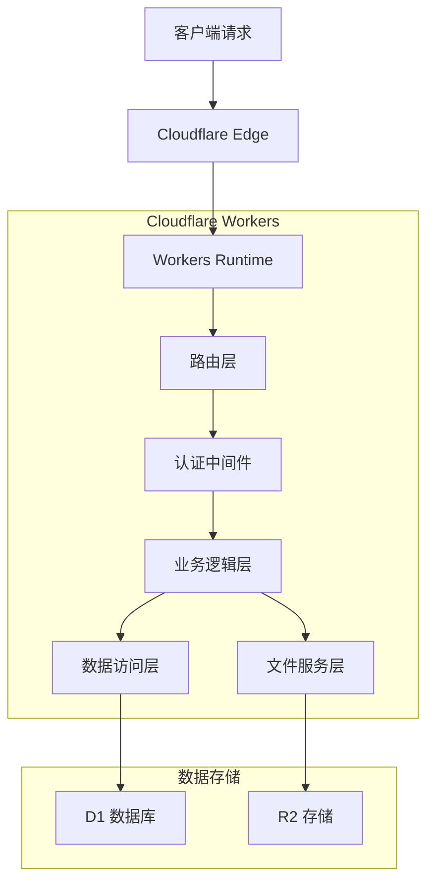
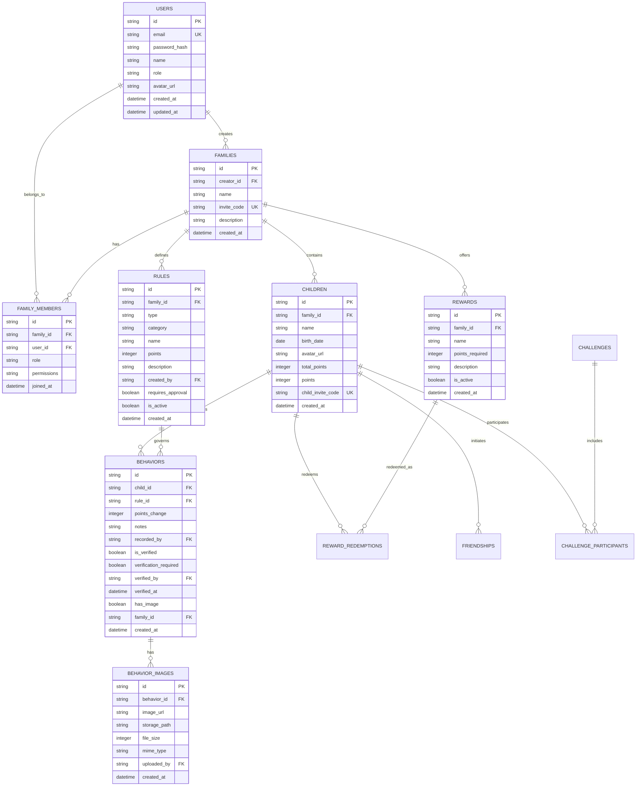

# 小星星成长记 - Cloudflare 技术架构文档

## 1. 架构设计



## 2. 技术描述

- **前端**: React@18 + TypeScript + Vite + TailwindCSS + Zustand
- **后端**: Cloudflare Workers + TypeScript
- **数据库**: Cloudflare D1 (SQLite)
- **文件存储**: Cloudflare R2
- **认证**: 自定义 JWT 认证
- **CDN**: Cloudflare CDN
- **部署**: Cloudflare Pages (前端) + Cloudflare Workers (后端)

## 3. 路由定义

| 路由 | 用途 |
|------|------|
| / | 首页，显示登录状态和导航 |
| /login | 登录页面，用户认证 |
| /register | 注册页面，新用户注册 |
| /home | 主页，显示家庭概览和最近活动 |
| /children | 儿童管理页面，查看和管理儿童信息 |
| /rules | 规则管理页面，创建和管理奖惩规则 |
| /behaviors | 行为记录页面，记录和查看行为 |
| /rewards | 奖励管理页面，设置和兑换奖励 |
| /reports | 报告页面，查看统计数据和分析 |
| /collaborate | 协作页面，家庭成员协作功能 |
| /community | 社区页面，挑战和社交功能 |
| /settings | 设置页面，用户和家庭设置 |

## 4. API 定义

### 4.1 核心 API

#### 认证相关

**用户注册**
```
POST /api/auth/register
```

请求参数:
| 参数名 | 参数类型 | 是否必需 | 描述 |
|--------|----------|----------|---------|
| email | string | true | 用户邮箱 |
| password | string | true | 用户密码 |
| name | string | true | 用户姓名 |

响应参数:
| 参数名 | 参数类型 | 描述 |
|--------|----------|---------|
| success | boolean | 请求是否成功 |
| token | string | JWT 认证令牌 |
| user | User | 用户信息 |

示例:
```json
{
  "email": "parent@example.com",
  "password": "securepassword",
  "name": "张三"
}
```

**用户登录**
```
POST /api/auth/login
```

请求参数:
| 参数名 | 参数类型 | 是否必需 | 描述 |
|--------|----------|----------|---------|
| email | string | true | 用户邮箱 |
| password | string | true | 用户密码 |

响应参数:
| 参数名 | 参数类型 | 描述 |
|--------|----------|---------|
| success | boolean | 请求是否成功 |
| token | string | JWT 认证令牌 |
| user | User | 用户信息 |

#### 家庭管理

**获取家庭信息**
```
GET /api/families
```

响应参数:
| 参数名 | 参数类型 | 描述 |
|--------|----------|---------|
| success | boolean | 请求是否成功 |
| families | Family[] | 用户所属的家庭列表 |

**创建家庭**
```
POST /api/families
```

请求参数:
| 参数名 | 参数类型 | 是否必需 | 描述 |
|--------|----------|----------|---------|
| name | string | true | 家庭名称 |
| description | string | false | 家庭描述 |

#### 儿童管理

**获取儿童列表**
```
GET /api/children
```

查询参数:
| 参数名 | 参数类型 | 是否必需 | 描述 |
|--------|----------|----------|---------|
| family_id | string | true | 家庭 ID |

**添加儿童**
```
POST /api/children
```

请求参数:
| 参数名 | 参数类型 | 是否必需 | 描述 |
|--------|----------|----------|---------|
| family_id | string | true | 家庭 ID |
| name | string | true | 儿童姓名 |
| birth_date | string | false | 出生日期 (YYYY-MM-DD) |
| avatar_url | string | false | 头像 URL |

#### 规则管理

**获取规则列表**
```
GET /api/rules
```

查询参数:
| 参数名 | 参数类型 | 是否必需 | 描述 |
|--------|----------|----------|---------|
| family_id | string | true | 家庭 ID |
| type | string | false | 规则类型 (reward/punishment) |

**创建规则**
```
POST /api/rules
```

请求参数:
| 参数名 | 参数类型 | 是否必需 | 描述 |
|--------|----------|----------|---------|
| family_id | string | true | 家庭 ID |
| type | string | true | 规则类型 (reward/punishment) |
| category | string | true | 规则分类 |
| name | string | true | 规则名称 |
| points | number | true | 积分值 |
| description | string | false | 规则描述 |
| requires_approval | boolean | false | 是否需要审批 |

#### 行为记录

**获取行为记录**
```
GET /api/behaviors
```

查询参数:
| 参数名 | 参数类型 | 是否必需 | 描述 |
|--------|----------|----------|---------|
| family_id | string | true | 家庭 ID |
| child_id | string | false | 儿童 ID |
| start_date | string | false | 开始日期 |
| end_date | string | false | 结束日期 |
| limit | number | false | 返回数量限制 |
| offset | number | false | 偏移量 |

**创建行为记录**
```
POST /api/behaviors
```

请求参数:
| 参数名 | 参数类型 | 是否必需 | 描述 |
|--------|----------|----------|---------|
| child_id | string | true | 儿童 ID |
| rule_id | string | true | 规则 ID |
| notes | string | false | 备注 |
| verification_required | boolean | false | 是否需要验证 |

#### 文件上传

**上传图片**
```
POST /api/upload/image
```

请求参数:
| 参数名 | 参数类型 | 是否必需 | 描述 |
|--------|----------|----------|---------|
| file | File | true | 图片文件 |
| type | string | false | 图片类型 (avatar/behavior) |

响应参数:
| 参数名 | 参数类型 | 描述 |
|--------|----------|---------|
| success | boolean | 上传是否成功 |
| image_url | string | 图片访问 URL |
| storage_path | string | 存储路径 |

### 4.2 数据类型定义

```typescript
interface User {
  id: string
  email: string
  name: string
  role: 'parent' | 'child'
  avatar_url?: string
  created_at: string
  updated_at: string
}

interface Family {
  id: string
  creator_id: string
  name: string
  invite_code: string
  description?: string
  created_at: string
}

interface Child {
  id: string
  family_id: string
  name: string
  birth_date?: string
  avatar_url?: string
  total_points: number
  points: number
  child_invite_code?: string
  created_at: string
}

interface Rule {
  id: string
  family_id: string
  type: 'reward' | 'punishment'
  category: string
  name: string
  points: number
  description?: string
  created_by: string
  requires_approval: boolean
  is_active: boolean
  created_at: string
}

interface Behavior {
  id: string
  child_id: string
  rule_id: string
  points_change: number
  notes?: string
  recorded_by: string
  is_verified: boolean
  verification_required: boolean
  verified_by?: string
  verified_at?: string
  has_image: boolean
  family_id: string
  created_at: string
}

interface Reward {
  id: string
  family_id: string
  name: string
  points_required: number
  description?: string
  is_active: boolean
  created_at: string
}
```

## 5. 服务器架构图



### 5.1 中间件架构

```typescript
// 请求处理流程
interface RequestContext {
  request: Request
  env: Env
  user?: User
  params?: Record<string, string>
}

type Middleware = (ctx: RequestContext, next: () => Promise<Response>) => Promise<Response>
type Handler = (ctx: RequestContext) => Promise<Response>

// 中间件链
const middlewares: Middleware[] = [
  corsMiddleware,      // CORS 处理
  authMiddleware,      // 认证验证
  validationMiddleware, // 数据验证
  rateLimitMiddleware, // 频率限制
]
```

### 5.2 错误处理

```typescript
interface ApiError {
  code: string
  message: string
  details?: any
}

interface ApiResponse<T = any> {
  success: boolean
  data?: T
  error?: ApiError
  timestamp: string
}

// 统一错误处理
function handleError(error: Error): Response {
  const apiError: ApiError = {
    code: 'INTERNAL_ERROR',
    message: error.message,
  }
  
  return Response.json({
    success: false,
    error: apiError,
    timestamp: new Date().toISOString(),
  }, { status: 500 })
}
```

## 6. 数据模型

### 6.1 数据模型定义



### 6.2 数据定义语言

**用户表 (users)**
```sql
CREATE TABLE users (
    id TEXT PRIMARY KEY,
    email TEXT UNIQUE NOT NULL,
    password_hash TEXT NOT NULL,
    name TEXT NOT NULL,
    role TEXT DEFAULT 'parent' CHECK (role IN ('parent', 'child')),
    avatar_url TEXT,
    created_at DATETIME DEFAULT CURRENT_TIMESTAMP,
    updated_at DATETIME DEFAULT CURRENT_TIMESTAMP
);

-- 创建索引
CREATE INDEX idx_users_email ON users(email);
CREATE INDEX idx_users_role ON users(role);

-- 初始数据
INSERT INTO users (id, email, password_hash, name, role) VALUES 
('demo-parent-1', 'demo@example.com', '$2b$10$demo_hash', '演示家长', 'parent');
```

**家庭表 (families)**
```sql
CREATE TABLE families (
    id TEXT PRIMARY KEY,
    creator_id TEXT NOT NULL,
    name TEXT NOT NULL,
    invite_code TEXT UNIQUE NOT NULL,
    description TEXT,
    created_at DATETIME DEFAULT CURRENT_TIMESTAMP,
    FOREIGN KEY (creator_id) REFERENCES users(id) ON DELETE CASCADE
);

-- 创建索引
CREATE INDEX idx_families_creator_id ON families(creator_id);
CREATE INDEX idx_families_invite_code ON families(invite_code);

-- 初始数据
INSERT INTO families (id, creator_id, name, invite_code, description) VALUES 
('demo-family-1', 'demo-parent-1', '演示家庭', 'DEMO123', '这是一个演示家庭');
```

**儿童表 (children)**
```sql
CREATE TABLE children (
    id TEXT PRIMARY KEY,
    family_id TEXT NOT NULL,
    name TEXT NOT NULL,
    birth_date DATE,
    avatar_url TEXT,
    total_points INTEGER DEFAULT 0,
    points INTEGER DEFAULT 0,
    child_invite_code TEXT UNIQUE,
    created_at DATETIME DEFAULT CURRENT_TIMESTAMP,
    FOREIGN KEY (family_id) REFERENCES families(id) ON DELETE CASCADE
);

-- 创建索引
CREATE INDEX idx_children_family_id ON children(family_id);
CREATE INDEX idx_children_child_invite_code ON children(child_invite_code);

-- 初始数据
INSERT INTO children (id, family_id, name, birth_date, total_points, points) VALUES 
('demo-child-1', 'demo-family-1', '小明', '2015-06-15', 100, 50),
('demo-child-2', 'demo-family-1', '小红', '2017-03-20', 80, 30);
```

**规则表 (rules)**
```sql
CREATE TABLE rules (
    id TEXT PRIMARY KEY,
    family_id TEXT NOT NULL,
    type TEXT CHECK (type IN ('reward', 'punishment')),
    category TEXT NOT NULL,
    name TEXT NOT NULL,
    points INTEGER NOT NULL,
    description TEXT,
    created_by TEXT,
    requires_approval BOOLEAN DEFAULT false,
    is_active BOOLEAN DEFAULT true,
    created_at DATETIME DEFAULT CURRENT_TIMESTAMP,
    FOREIGN KEY (family_id) REFERENCES families(id) ON DELETE CASCADE,
    FOREIGN KEY (created_by) REFERENCES users(id)
);

-- 创建索引
CREATE INDEX idx_rules_family_id ON rules(family_id);
CREATE INDEX idx_rules_type ON rules(type);
CREATE INDEX idx_rules_is_active ON rules(is_active);

-- 初始数据
INSERT INTO rules (id, family_id, type, category, name, points, description, created_by, is_active) VALUES 
('demo-rule-1', 'demo-family-1', 'reward', '学习', '完成作业', 10, '按时完成当天作业', 'demo-parent-1', true),
('demo-rule-2', 'demo-family-1', 'reward', '家务', '整理房间', 5, '主动整理自己的房间', 'demo-parent-1', true),
('demo-rule-3', 'demo-family-1', 'punishment', '行为', '说谎', -10, '对家长或老师说谎', 'demo-parent-1', true);
```

**行为记录表 (behaviors)**
```sql
CREATE TABLE behaviors (
    id TEXT PRIMARY KEY,
    child_id TEXT NOT NULL,
    rule_id TEXT NOT NULL,
    points_change INTEGER NOT NULL,
    notes TEXT,
    recorded_by TEXT,
    is_verified BOOLEAN DEFAULT false,
    verification_required BOOLEAN DEFAULT false,
    verified_by TEXT,
    verified_at DATETIME,
    has_image BOOLEAN DEFAULT false,
    family_id TEXT NOT NULL,
    created_at DATETIME DEFAULT CURRENT_TIMESTAMP,
    FOREIGN KEY (child_id) REFERENCES children(id) ON DELETE CASCADE,
    FOREIGN KEY (rule_id) REFERENCES rules(id) ON DELETE CASCADE,
    FOREIGN KEY (recorded_by) REFERENCES users(id),
    FOREIGN KEY (verified_by) REFERENCES users(id),
    FOREIGN KEY (family_id) REFERENCES families(id) ON DELETE CASCADE
);

-- 创建索引
CREATE INDEX idx_behaviors_child_id ON behaviors(child_id);
CREATE INDEX idx_behaviors_family_id ON behaviors(family_id);
CREATE INDEX idx_behaviors_created_at ON behaviors(created_at DESC);
CREATE INDEX idx_behaviors_is_verified ON behaviors(is_verified);

-- 初始数据
INSERT INTO behaviors (id, child_id, rule_id, points_change, notes, recorded_by, is_verified, family_id) VALUES 
('demo-behavior-1', 'demo-child-1', 'demo-rule-1', 10, '今天按时完成了数学作业', 'demo-parent-1', true, 'demo-family-1'),
('demo-behavior-2', 'demo-child-2', 'demo-rule-2', 5, '主动整理了房间，很棒！', 'demo-parent-1', true, 'demo-family-1');
```

## 7. 部署配置

### 7.1 Wrangler 配置

```toml
# wrangler.toml
name = "starkid-api"
main = "src/index.ts"
compatibility_date = "2024-01-01"
compatibility_flags = ["nodejs_compat"]

# D1 数据库绑定
[[d1_databases]]
binding = "DB"
database_name = "starkid-production"
database_id = "your-production-database-id"

# R2 存储绑定
[[r2_buckets]]
binding = "R2_BUCKET"
bucket_name = "starkid-images"

# 环境变量
[vars]
ENVIRONMENT = "production"
JWT_SECRET = "your-jwt-secret-key"
JWT_EXPIRES_IN = "7d"
CORS_ORIGIN = "https://your-frontend-domain.com"
MAX_FILE_SIZE = "5242880"  # 5MB
ALLOWED_FILE_TYPES = "image/jpeg,image/png,image/webp"

# 开发环境配置
[env.development]
[[env.development.d1_databases]]
binding = "DB"
database_name = "starkid-development"
database_id = "your-development-database-id"

[env.development.vars]
ENVIRONMENT = "development"
CORS_ORIGIN = "http://localhost:5173"
```

### 7.2 前端部署配置

```json
// package.json
{
  "scripts": {
    "build": "vite build",
    "preview": "vite preview",
    "deploy": "npm run build && wrangler pages deploy dist"
  }
}
```

```javascript
// vite.config.ts
import { defineConfig } from 'vite'
import react from '@vitejs/plugin-react'

export default defineConfig({
  plugins: [react()],
  build: {
    outDir: 'dist',
    sourcemap: true,
    rollupOptions: {
      output: {
        manualChunks: {
          vendor: ['react', 'react-dom'],
          ui: ['lucide-react', 'sonner'],
          store: ['zustand']
        }
      }
    }
  },
  define: {
    'process.env.NODE_ENV': JSON.stringify(process.env.NODE_ENV)
  }
})
```

### 7.3 CI/CD 配置

```yaml
# .github/workflows/deploy.yml
name: Deploy to Cloudflare

on:
  push:
    branches: [main]
  pull_request:
    branches: [main]

jobs:
  deploy-workers:
    runs-on: ubuntu-latest
    steps:
      - uses: actions/checkout@v3
      
      - name: Setup Node.js
        uses: actions/setup-node@v3
        with:
          node-version: '18'
          cache: 'npm'
      
      - name: Install dependencies
        run: npm ci
        working-directory: ./workers
      
      - name: Run tests
        run: npm test
        working-directory: ./workers
      
      - name: Deploy Workers
        uses: cloudflare/wrangler-action@v3
        with:
          apiToken: ${{ secrets.CLOUDFLARE_API_TOKEN }}
          workingDirectory: './workers'
          command: deploy
  
  deploy-frontend:
    runs-on: ubuntu-latest
    needs: deploy-workers
    steps:
      - uses: actions/checkout@v3
      
      - name: Setup Node.js
        uses: actions/setup-node@v3
        with:
          node-version: '18'
          cache: 'npm'
      
      - name: Install dependencies
        run: npm ci
      
      - name: Build frontend
        run: npm run build
        env:
          VITE_API_BASE_URL: ${{ secrets.VITE_API_BASE_URL }}
      
      - name: Deploy to Cloudflare Pages
        uses: cloudflare/pages-action@v1
        with:
          apiToken: ${{ secrets.CLOUDFLARE_API_TOKEN }}
          accountId: ${{ secrets.CLOUDFLARE_ACCOUNT_ID }}
          projectName: 'starkid-frontend'
          directory: './dist'
```

这个技术架构文档详细描述了迁移到 Cloudflare 技术栈后的完整系统架构，包括 API 设计、数据模型、部署配置等关键技术细节，为开发团队提供了清晰的技术实现指南。