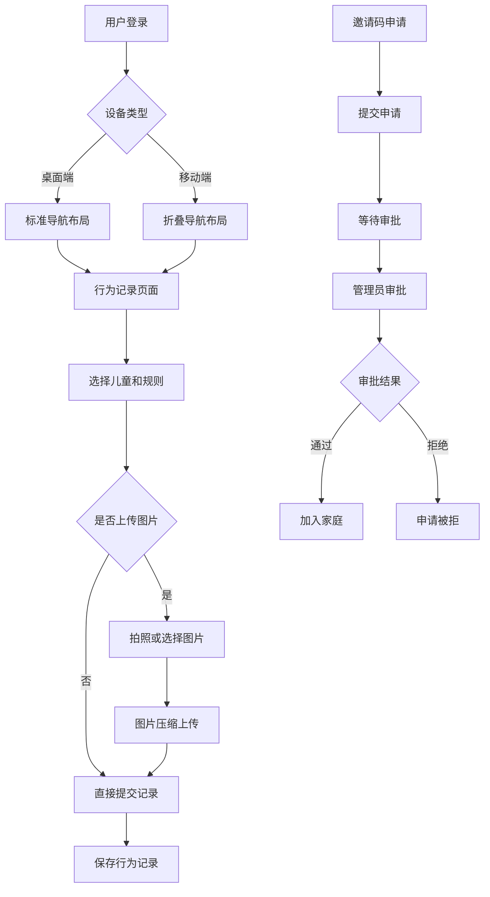

# StarKid 家庭教育管理系统功能优化需求文档

## 1. 产品概述

StarKid 是一个基于 React + TypeScript + Vite 技术栈的家庭教育管理系统，旨在帮助家长更好地记录和管理孩子的行为表现，通过积分奖励机制激励孩子养成良好习惯。本次优化主要针对用户体验和功能完善进行改进。

本次优化将解决移动端适配问题、增强行为记录功能的丰富性，以及完善家庭成员管理的安全性，提升产品的实用性和用户满意度。

## 2. 核心功能

### 2.1 用户角色

| 角色 | 注册方式 | 核心权限 |
|------|----------|----------|
| 家庭创建者 | 邮箱注册并创建家庭 | 管理家庭成员、审批加入申请、管理所有功能 |
| 家庭成员 | 邀请码加入（需审批） | 记录行为、查看报告、参与互动 |
| 待审批用户 | 邀请码申请加入 | 仅可查看申请状态 |

### 2.2 功能模块

本次优化涉及以下主要页面的功能增强：

1. **行为记录页面**：增加图片上传功能，支持拍照记录行为瞬间
2. **移动端适配**：优化所有页面的响应式设计，适配主流手机屏幕
3. **家庭成员管理页面**：增加邀请审批流程，完善成员权限管理
4. **设置页面**：新增审批管理功能，支持批量处理申请

### 2.3 页面详情

| 页面名称 | 模块名称 | 功能描述 |
|----------|----------|----------|
| 行为记录页面 | 图片上传模块 | 支持拍照或选择图片上传，图片压缩处理，非必填项 |
| 行为记录页面 | 移动端优化 | 响应式表单布局，触摸友好的操作界面，滑动操作支持 |
| 所有页面 | 响应式布局 | 适配320px-768px屏幕宽度，导航栏折叠，内容自适应 |
| 家庭成员管理 | 邀请审批流程 | 邀请码申请提交，管理员审批界面，申请状态跟踪 |
| 设置页面 | 审批管理 | 待审批列表，批量操作，审批历史记录 |
| 协作页面 | 成员权限管理 | 角色权限设置，成员状态管理，邀请码生成优化 |

## 3. 核心流程

### 3.1 行为记录流程（含图片上传）

用户在行为记录页面选择儿童和规则后，可选择上传图片记录行为瞬间。系统支持拍照或从相册选择，自动压缩图片并上传到 Supabase Storage，最后保存行为记录。

### 3.2 家庭成员邀请审批流程

管理员生成邀请码 → 新用户使用邀请码申请加入 → 系统创建待审批记录 → 管理员在审批页面处理申请 → 审批通过后用户正式加入家庭 → 获得相应权限。

### 3.3 移动端用户操作流程

移动端用户通过折叠导航栏访问各功能模块，使用触摸友好的界面进行操作，支持手势滑动和长按等移动端特有交互。

## 4. 用户界面设计

### 4.1 设计风格

- **主色调**：保持现有的黄色主题 (#F59E0B)，辅助色为橙色 (#EA580C)
- **按钮样式**：圆角设计，支持触摸反馈，移动端按钮高度不小于44px
- **字体**：系统默认字体，移动端最小字号14px，确保可读性
- **布局风格**：卡片式设计，移动端采用单列布局，桌面端保持多列网格
- **图标风格**：使用 Lucide React 图标库，统一视觉风格

### 4.2 页面设计概览

| 页面名称 | 模块名称 | UI元素 |
|----------|----------|--------|
| 行为记录页面 | 图片上传区域 | 拍照按钮、图片预览、删除按钮，移动端全屏预览支持 |
| 行为记录页面 | 移动端表单 | 垂直布局，大按钮设计，下拉选择器优化 |
| 导航组件 | 移动端导航 | 汉堡菜单，底部导航栏，滑动抽屉 |
| 审批管理页面 | 申请列表 | 卡片式布局，状态标签，操作按钮组 |
| 所有页面 | 响应式容器 | 弹性布局，断点适配，内容自适应 |

### 4.3 响应式设计

产品采用移动优先的响应式设计策略，支持以下断点：

- **移动端**：320px - 767px（单列布局，折叠导航）
- **平板端**：768px - 1023px（双列布局，侧边导航）
- **桌面端**：1024px+（多列布局，完整导航）

移动端特别优化触摸交互，包括滑动操作、长按菜单、手势导航等，确保在各种移动设备上都有良好的用户体验。