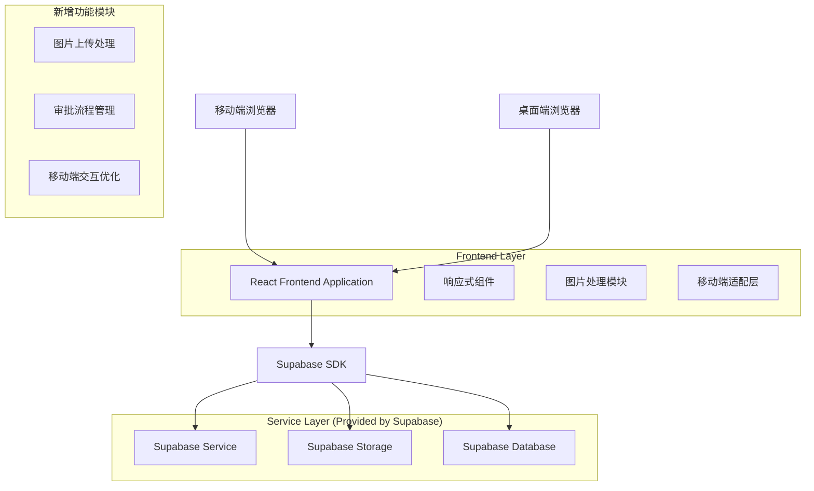
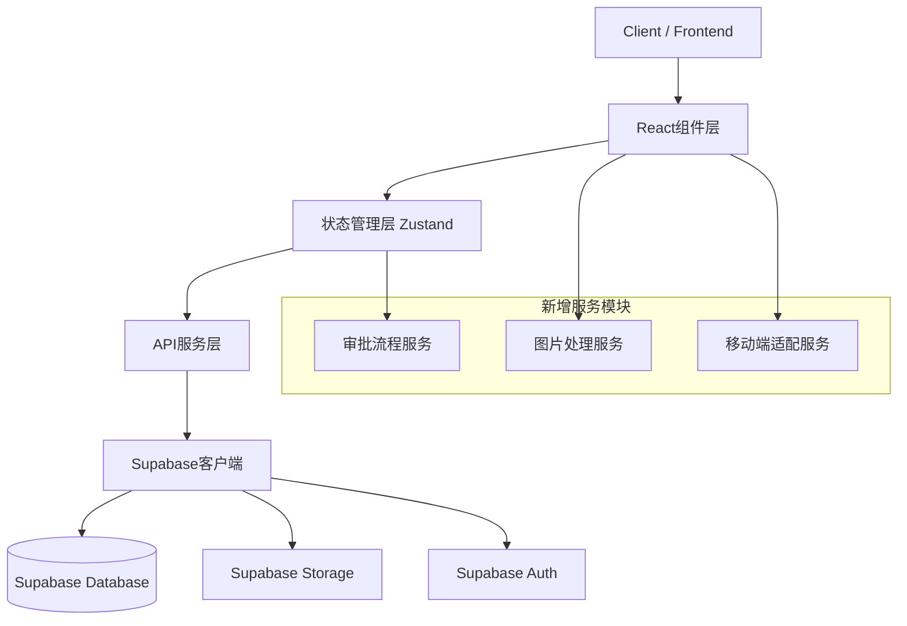
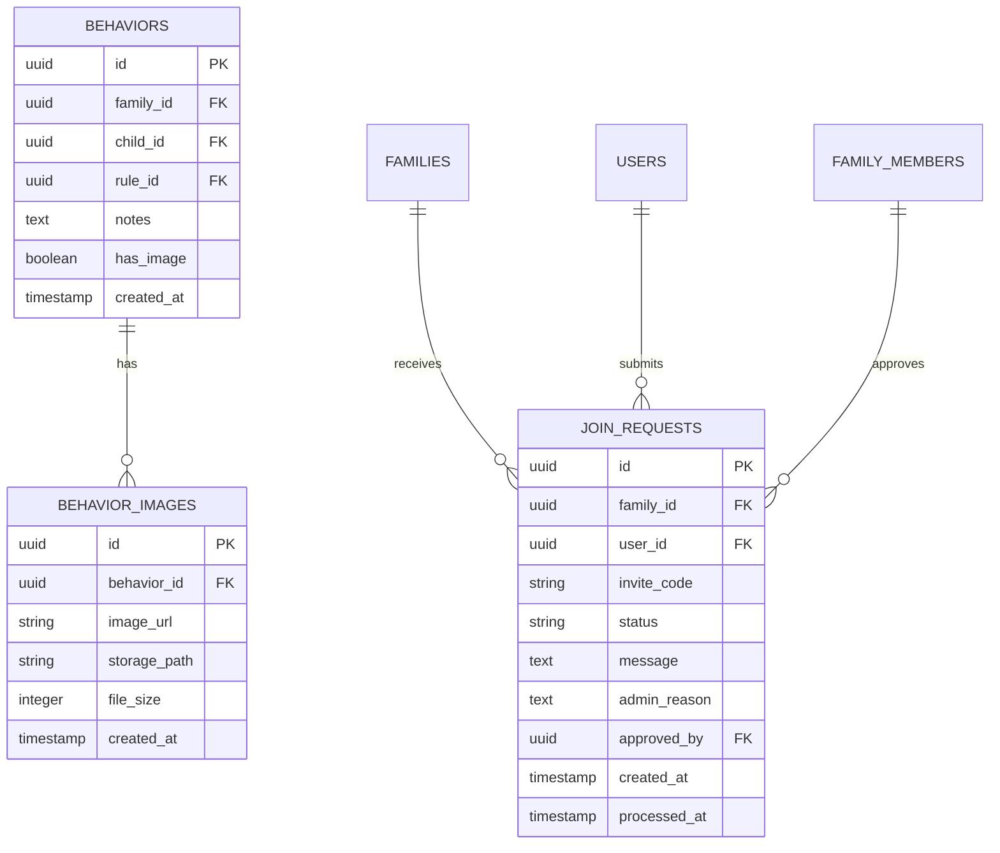

# StarKid 技术架构优化方案

## 1. 架构设计



## 2. 技术描述

- **Frontend**: React@18 + TypeScript + Tailwind CSS@3 + Vite
- **Backend**: Supabase (PostgreSQL + Storage + Auth)
- **图片处理**: browser-image-compression + Canvas API
- **移动端适配**: CSS Grid + Flexbox + Media Queries
- **状态管理**: Zustand
- **UI组件**: Lucide React + Headless UI

## 3. 路由定义

| 路由 | 用途 | 移动端优化 |
|------|------|------------|
| / | 首页，显示主要内容和导航 | 卡片式布局，触摸友好 |
| /behaviors | 行为记录页面，支持图片上传 | 全屏表单，大按钮设计 |
| /settings | 设置页面，包含审批管理 | 分组折叠，滑动操作 |
| /collaborate | 家长协作页面，成员管理 | 列表优化，状态标签 |
| /approval | 新增审批管理页面 | 卡片式申请列表 |

## 4. API 定义

### 4.1 图片上传相关 API

**上传行为图片**
```
POST /storage/v1/object/behavior-images/{filename}
```

Request:
| 参数名称 | 参数类型 | 是否必填 | 描述 |
|----------|----------|----------|------|
| file | File | true | 压缩后的图片文件 |
| behavior_id | string | true | 行为记录ID |

Response:
| 参数名称 | 参数类型 | 描述 |
|----------|----------|------|
| url | string | 图片访问URL |
| path | string | 存储路径 |

### 4.2 审批流程相关 API

**提交加入申请**
```
POST /api/family/join-request
```

Request:
| 参数名称 | 参数类型 | 是否必填 | 描述 |
|----------|----------|----------|------|
| invite_code | string | true | 邀请码 |
| message | string | false | 申请说明 |

Response:
| 参数名称 | 参数类型 | 描述 |
|----------|----------|------|
| request_id | string | 申请ID |
| status | string | 申请状态 |

**处理审批申请**
```
PUT /api/family/join-request/{request_id}
```

Request:
| 参数名称 | 参数类型 | 是否必填 | 描述 |
|----------|----------|----------|------|
| action | string | true | approve/reject |
| reason | string | false | 处理原因 |

## 5. 服务器架构图



## 6. 数据模型

### 6.1 数据模型定义



### 6.2 数据定义语言

**行为图片表 (behavior_images)**
```sql
-- 创建行为图片表
CREATE TABLE behavior_images (
    id UUID PRIMARY KEY DEFAULT gen_random_uuid(),
    behavior_id UUID REFERENCES behaviors(id) ON DELETE CASCADE,
    image_url TEXT NOT NULL,
    storage_path TEXT NOT NULL,
    file_size INTEGER,
    mime_type VARCHAR(50),
    created_at TIMESTAMP WITH TIME ZONE DEFAULT NOW()
);

-- 创建索引
CREATE INDEX idx_behavior_images_behavior_id ON behavior_images(behavior_id);
CREATE INDEX idx_behavior_images_created_at ON behavior_images(created_at DESC);

-- 设置RLS策略
ALTER TABLE behavior_images ENABLE ROW LEVEL SECURITY;

CREATE POLICY "Users can view behavior images from their family" ON behavior_images
    FOR SELECT USING (
        behavior_id IN (
            SELECT b.id FROM behaviors b
            JOIN family_members fm ON b.family_id = fm.family_id
            WHERE fm.user_id = auth.uid()
        )
    );

CREATE POLICY "Users can insert behavior images for their family" ON behavior_images
    FOR INSERT WITH CHECK (
        behavior_id IN (
            SELECT b.id FROM behaviors b
            JOIN family_members fm ON b.family_id = fm.family_id
            WHERE fm.user_id = auth.uid()
        )
    );
```

**加入申请表 (join_requests)**
```sql
-- 创建加入申请表
CREATE TABLE join_requests (
    id UUID PRIMARY KEY DEFAULT gen_random_uuid(),
    family_id UUID REFERENCES families(id) ON DELETE CASCADE,
    user_id UUID REFERENCES users(id) ON DELETE CASCADE,
    invite_code VARCHAR(6) NOT NULL,
    status VARCHAR(20) DEFAULT 'pending' CHECK (status IN ('pending', 'approved', 'rejected')),
    message TEXT,
    admin_reason TEXT,
    approved_by UUID REFERENCES users(id),
    created_at TIMESTAMP WITH TIME ZONE DEFAULT NOW(),
    processed_at TIMESTAMP WITH TIME ZONE,
    UNIQUE(family_id, user_id)
);

-- 创建索引
CREATE INDEX idx_join_requests_family_id ON join_requests(family_id);
CREATE INDEX idx_join_requests_user_id ON join_requests(user_id);
CREATE INDEX idx_join_requests_status ON join_requests(status);
CREATE INDEX idx_join_requests_created_at ON join_requests(created_at DESC);

-- 设置RLS策略
ALTER TABLE join_requests ENABLE ROW LEVEL SECURITY;

CREATE POLICY "Users can view their own join requests" ON join_requests
    FOR SELECT USING (user_id = auth.uid());

CREATE POLICY "Family admins can view join requests for their family" ON join_requests
    FOR SELECT USING (
        family_id IN (
            SELECT family_id FROM family_members 
            WHERE user_id = auth.uid() AND role = 'admin'
        )
    );

CREATE POLICY "Users can create join requests" ON join_requests
    FOR INSERT WITH CHECK (user_id = auth.uid());

CREATE POLICY "Family admins can update join requests" ON join_requests
    FOR UPDATE USING (
        family_id IN (
            SELECT family_id FROM family_members 
            WHERE user_id = auth.uid() AND role = 'admin'
        )
    );
```

**更新behaviors表支持图片**
```sql
-- 为behaviors表添加图片支持字段
ALTER TABLE behaviors ADD COLUMN has_image BOOLEAN DEFAULT false;

-- 创建触发器自动更新has_image字段
CREATE OR REPLACE FUNCTION update_behavior_has_image()
RETURNS TRIGGER AS $$
BEGIN
    IF TG_OP = 'INSERT' THEN
        UPDATE behaviors SET has_image = true WHERE id = NEW.behavior_id;
        RETURN NEW;
    ELSIF TG_OP = 'DELETE' THEN
        UPDATE behaviors SET has_image = (
            EXISTS(SELECT 1 FROM behavior_images WHERE behavior_id = OLD.behavior_id)
        ) WHERE id = OLD.behavior_id;
        RETURN OLD;
    END IF;
    RETURN NULL;
END;
$$ LANGUAGE plpgsql;

CREATE TRIGGER trigger_update_behavior_has_image
    AFTER INSERT OR DELETE ON behavior_images
    FOR EACH ROW EXECUTE FUNCTION update_behavior_has_image();
```

**存储桶配置**
```sql
-- 创建行为图片存储桶
INSERT INTO storage.buckets (id, name, public)
VALUES ('behavior-images', 'behavior-images', true);

-- 设置存储策略
CREATE POLICY "Users can upload behavior images" ON storage.objects
    FOR INSERT WITH CHECK (
        bucket_id = 'behavior-images' AND
        auth.uid()::text = (storage.foldername(name))[1]
    );

CREATE POLICY "Users can view behavior images" ON storage.objects
    FOR SELECT USING (bucket_id = 'behavior-images');

CREATE POLICY "Users can delete their behavior images" ON storage.objects
    FOR DELETE USING (
        bucket_id = 'behavior-images' AND
        auth.uid()::text = (storage.foldername(name))[1]
    );
```