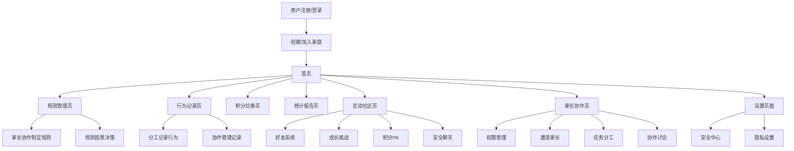

# 小星星成长记 - 产品需求文档

## 1. 产品概述

小星星成长记是一个家庭儿童奖惩制度管理系统，帮助家长建立科学有效的儿童行为管理体系。

产品旨在解决家长在儿童教育中缺乏系统性奖惩机制的问题，为3-12岁儿童家庭提供个性化的行为管理工具，通过游戏化的积分制度培养孩子良好习惯。

目标是成为家庭教育领域的专业工具，帮助千万家庭建立和谐的亲子关系。

## 2. 核心功能

### 2.1 用户角色

| 角色 | 注册方式 | 核心权限 |
|------|----------|----------|
| 主管理员家长 | 手机号/邮箱注册 | 创建家庭、管理所有规则、邀请其他家长、管理儿童账户 |
| 协管理员家长 | 家庭邀请码加入 | 记录孩子行为、查看统计报告、参与规则讨论 |
| 儿童用户 | 家长创建账户 | 查看自己的积分和奖励、参与互动游戏、邀请小朋友互动 |
| 访客儿童 | 儿童邀请码加入 | 参与限定的互动活动、查看公开的成长挑战 |

### 2.2 功能模块

我们的产品包含以下主要页面：

1. **首页**：产品介绍、快速导航、今日积分概览、好友动态
2. **规则管理页**：自定义奖励规则、惩罚规则的增删改查、家长协作制定
3. **行为记录页**：记录孩子日常行为表现、积分变化、家长分工记录
4. **积分兑换页**：查看可兑换奖励、执行积分兑换
5. **统计报告页**：行为趋势分析、成长报告生成、家庭对比
6. **互动社区页**：小朋友互动、成长挑战、积分PK、安全聊天
7. **家长协作页**：多家长管理、权限设置、协作讨论、任务分工
8. **设置页面**：用户信息管理、系统设置、隐私安全

### 2.3 页面详情

| 页面名称 | 模块名称 | 功能描述 |
|----------|----------|----------|
| 首页 | 导航模块 | 显示主要功能入口，快速访问各个模块 |
| 首页 | 积分概览 | 展示当前积分、本周表现、待兑换奖励 |
| 首页 | 好友动态 | 显示小朋友好友的最新动态、成就分享 |
| 规则管理页 | 奖励规则管理 | 添加、编辑、删除日常奖励和特殊奖励规则 |
| 规则管理页 | 惩罚规则管理 | 管理轻微、中等、严重三级惩罚规则 |
| 规则管理页 | 规则模板 | 提供预设规则模板，支持一键导入 |
| 规则管理页 | 家长协作 | 多家长共同制定规则、投票决策、讨论区 |
| 行为记录页 | 行为记录 | 记录具体行为表现，自动计算积分变化 |
| 行为记录页 | 历史记录 | 查看历史行为记录，支持筛选和搜索 |
| 行为记录页 | 分工记录 | 家长分工记录不同行为，避免重复记录 |
| 积分兑换页 | 奖励展示 | 按积分等级展示可兑换的奖励项目 |
| 积分兑换页 | 兑换操作 | 执行积分兑换，记录兑换历史 |
| 统计报告页 | 数据可视化 | 生成行为趋势图表、积分变化曲线 |
| 统计报告页 | 成长报告 | 生成周报、月报，分析孩子成长进步 |
| 统计报告页 | 家庭对比 | 多家庭数据对比、排行榜、成长里程碑 |
| 互动社区页 | 好友系统 | 添加小朋友好友、管理好友列表、安全验证 |
| 互动社区页 | 成长挑战 | 发起和参与成长挑战、团队任务、积分竞赛 |
| 互动社区页 | 安全聊天 | 预设表情和短语聊天、家长监督、内容过滤 |
| 互动社区页 | 积分PK | 小朋友之间的积分比拼、排行榜、成就展示 |
| 家长协作页 | 权限管理 | 设置不同家长的管理权限、角色分配 |
| 家长协作页 | 协作讨论 | 家长之间的沟通讨论、决策投票、意见收集 |
| 家长协作页 | 任务分工 | 分配记录任务、提醒通知、完成状态跟踪 |
| 家长协作页 | 邀请管理 | 生成家长邀请码、管理邀请状态、权限审核 |
| 设置页面 | 用户管理 | 管理家庭成员信息、权限设置 |
| 设置页面 | 系统设置 | 通知设置、数据备份、隐私设置 |
| 设置页面 | 安全中心 | 儿童账户安全、家长监督设置、隐私保护 |

## 3. 核心流程

**主管理员家长流程：**
用户注册登录 → 创建家庭 → 添加孩子信息 → 设置奖惩规则 → 邀请其他家长 → 分配管理权限 → 协作管理孩子行为 → 查看统计报告

**协管理员家长流程：**
接受邀请加入家庭 → 了解家庭规则 → 参与规则讨论 → 分工记录孩子行为 → 协作决策奖惩 → 查看成长报告

**儿童用户流程：**
家长创建账户 → 了解家庭规则 → 查看自己的积分 → 邀请小朋友好友 → 参与成长挑战 → 积分PK互动 → 申请奖励兑换

**访客儿童流程：**
通过儿童邀请码加入 → 参与限定互动活动 → 查看公开挑战 → 与好友安全聊天 → 参与团队任务

## 4. 用户界面设计

### 4.1 设计风格

- **主色调**：温暖橙色 #fdcb6e，活力蓝色 #74b9ff
- **辅助色**：成功绿色 #00b894，警告红色 #e17055
- **按钮风格**：圆角卡片式设计，带有轻微阴影效果
- **字体**：Comic Sans MS 儿童友好字体，主要字号 16px-24px
- **布局风格**：卡片式布局，响应式网格设计
- **图标风格**：使用表情符号和动物图标，增加趣味性

### 4.2 页面设计概览

| 页面名称 | 模块名称 | UI元素 |
|----------|----------|--------|
| 首页 | 导航模块 | 彩色卡片式导航按钮，使用渐变背景，圆角设计，hover动画效果 |
| 首页 | 积分概览 | 大号数字显示积分，进度条显示目标完成度，星星动画效果 |
| 规则管理页 | 规则列表 | 表格形式展示，支持拖拽排序，行内编辑功能，删除确认弹窗 |
| 规则管理页 | 添加规则 | 模态框表单，表情符号选择器，积分滑块控件，分类标签 |
| 行为记录页 | 记录表单 | 快速选择按钮，时间选择器，备注文本框，一键提交 |
| 积分兑换页 | 奖励卡片 | 3D卡片效果，积分标签，兑换按钮，库存显示 |
| 统计报告页 | 图表展示 | 彩色柱状图，折线图，饼图，可交互的时间筛选器 |

### 4.3 响应式设计

产品采用移动优先的响应式设计，支持手机、平板、桌面端访问。针对触屏设备优化交互体验，按钮大小适合手指操作，支持手势滑动和长按操作。

## 5. 邀请功能设计

### 5.1 家长邀请系统

**邀请码生成机制：**
- 主管理员家长可生成8位数字字母组合的家庭邀请码
- 邀请码有效期为7天，可设置使用次数限制
- 支持生成一次性邀请码和永久邀请码两种类型

**权限分配流程：**
1. 主管理员发送邀请码给其他家长
2. 受邀家长通过邀请码加入家庭
3. 主管理员设置受邀家长的权限级别（协管理员/观察者）
4. 系统发送权限确认通知给所有家庭成员

**协作管理功能：**
- 规则制定投票：重要规则需多数家长同意
- 任务分工：按时间段或行为类型分配记录责任
- 实时同步：所有家长可实时查看行为记录和积分变化
- 讨论区：家长可就教育方式进行沟通讨论

### 5.2 儿童互动邀请

**儿童邀请码系统：**
- 儿童用户可生成6位数字的好友邀请码
- 邀请码24小时内有效，仅限单次使用
- 家长需预先审核并批准儿童的好友邀请

**安全验证机制：**
- 双向家长确认：双方家长都需同意孩子建立好友关系
- 年龄匹配：系统自动匹配相近年龄段的儿童
- 地域限制：可设置仅允许同城或同校儿童互动

**互动功能设计：**
- 成长挑战：发起21天习惯养成挑战，邀请好友参与
- 积分PK：周度积分比拼，设置健康竞争机制
- 团队任务：多人协作完成大型成长任务
- 成就分享：在安全环境下分享成长里程碑

### 5.3 安全聊天系统

**内容安全机制：**
- 预设表情包和短语库，限制自由文本输入
- AI内容过滤，自动识别不当言论
- 家长实时监督，可查看所有聊天记录
- 举报机制，支持一键举报不当行为

**隐私保护措施：**
- 不显示真实姓名，使用昵称系统
- 不允许交换个人信息（电话、地址等）
- 聊天记录定期清理，保护儿童隐私
- 家长可随时终止儿童的好友关系

## 6. 安全与隐私保护

### 6.1 儿童账户安全

**账户管理：**
- 儿童账户由家长创建和管理，无独立密码
- 使用家长设备登录，支持指纹/面部识别
- 定时自动登出，防止长时间无监督使用
- 家长可远程锁定儿童账户

**使用时间控制：**
- 设置每日使用时长限制
- 支持学习时间段禁用功能
- 睡眠时间自动锁定
- 使用时长统计和提醒

### 6.2 数据安全保护

**数据加密：**
- 所有用户数据采用AES-256加密存储
- 传输过程使用HTTPS协议
- 敏感信息（如聊天记录）额外加密
- 定期安全审计和漏洞扫描

**隐私控制：**
- 最小化数据收集原则
- 用户可控制数据分享范围
- 支持数据导出和删除请求
- 严格遵守儿童隐私保护法规

### 6.3 家长监督功能

**实时监控：**
- 查看儿童所有互动记录
- 接收异常行为实时通知
- 监督好友关系和聊天内容
- 查看使用时长和活跃时段

**干预机制：**
- 一键暂停儿童账户功能
- 删除不当好友关系
- 设置特定功能的使用限制
- 紧急联系和求助功能