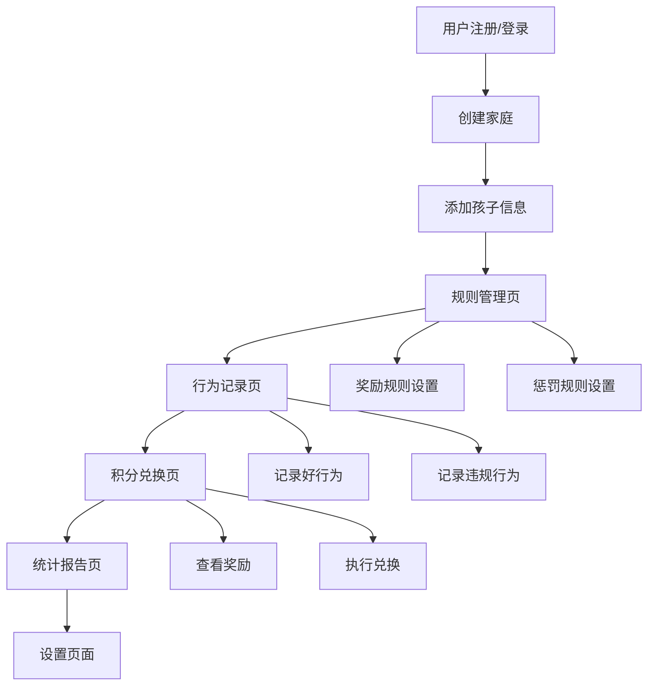

# 小星星成长记 - 产品需求文档

## 1. 产品概述

小星星成长记是一个家庭儿童奖惩制度管理系统，帮助家长建立科学有效的儿童行为管理体系。

产品旨在解决家长在儿童教育中缺乏系统性奖惩机制的问题，为3-12岁儿童家庭提供个性化的行为管理工具，通过游戏化的积分制度培养孩子良好习惯。

目标是成为家庭教育领域的专业工具，帮助千万家庭建立和谐的亲子关系。

## 2. 核心功能

### 2.1 用户角色

| 角色 | 注册方式 | 核心权限 |
|------|----------|----------|
| 家长用户 | 手机号/邮箱注册 | 创建和管理奖惩规则、记录孩子行为、查看统计报告 |
| 儿童用户 | 家长邀请码添加 | 查看自己的积分和奖励、参与互动游戏 |

### 2.2 功能模块

我们的产品包含以下主要页面：

1. **首页**：产品介绍、快速导航、今日积分概览
2. **规则管理页**：自定义奖励规则、惩罚规则的增删改查
3. **行为记录页**：记录孩子日常行为表现、积分变化
4. **积分兑换页**：查看可兑换奖励、执行积分兑换
5. **统计报告页**：行为趋势分析、成长报告生成
6. **设置页面**：用户信息管理、系统设置

### 2.3 页面详情

| 页面名称 | 模块名称 | 功能描述 |
|----------|----------|----------|
| 首页 | 导航模块 | 显示主要功能入口，快速访问各个模块 |
| 首页 | 积分概览 | 展示当前积分、本周表现、待兑换奖励 |
| 规则管理页 | 奖励规则管理 | 添加、编辑、删除日常奖励和特殊奖励规则 |
| 规则管理页 | 惩罚规则管理 | 管理轻微、中等、严重三级惩罚规则 |
| 规则管理页 | 规则模板 | 提供预设规则模板，支持一键导入 |
| 行为记录页 | 行为记录 | 记录具体行为表现，自动计算积分变化 |
| 行为记录页 | 历史记录 | 查看历史行为记录，支持筛选和搜索 |
| 积分兑换页 | 奖励展示 | 按积分等级展示可兑换的奖励项目 |
| 积分兑换页 | 兑换操作 | 执行积分兑换，记录兑换历史 |
| 统计报告页 | 数据可视化 | 生成行为趋势图表、积分变化曲线 |
| 统计报告页 | 成长报告 | 生成周报、月报，分析孩子成长进步 |
| 设置页面 | 用户管理 | 管理家庭成员信息、权限设置 |
| 设置页面 | 系统设置 | 通知设置、数据备份、隐私设置 |

## 3. 核心流程

**家长用户流程：**
用户注册登录 → 创建家庭 → 添加孩子信息 → 设置奖惩规则 → 记录孩子行为 → 查看统计报告 → 执行奖励兑换

**儿童用户流程：**
通过邀请码加入 → 查看自己的积分 → 浏览可兑换奖励 → 申请奖励兑换 → 参与互动游戏

## 4. 用户界面设计

### 4.1 设计风格

- **主色调**：温暖橙色 #fdcb6e，活力蓝色 #74b9ff
- **辅助色**：成功绿色 #00b894，警告红色 #e17055
- **按钮风格**：圆角卡片式设计，带有轻微阴影效果
- **字体**：Comic Sans MS 儿童友好字体，主要字号 16px-24px
- **布局风格**：卡片式布局，响应式网格设计
- **图标风格**：使用表情符号和动物图标，增加趣味性

### 4.2 页面设计概览

| 页面名称 | 模块名称 | UI元素 |
|----------|----------|--------|
| 首页 | 导航模块 | 彩色卡片式导航按钮，使用渐变背景，圆角设计，hover动画效果 |
| 首页 | 积分概览 | 大号数字显示积分，进度条显示目标完成度，星星动画效果 |
| 规则管理页 | 规则列表 | 表格形式展示，支持拖拽排序，行内编辑功能，删除确认弹窗 |
| 规则管理页 | 添加规则 | 模态框表单，表情符号选择器，积分滑块控件，分类标签 |
| 行为记录页 | 记录表单 | 快速选择按钮，时间选择器，备注文本框，一键提交 |
| 积分兑换页 | 奖励卡片 | 3D卡片效果，积分标签，兑换按钮，库存显示 |
| 统计报告页 | 图表展示 | 彩色柱状图，折线图，饼图，可交互的时间筛选器 |

### 4.3 响应式设计

产品采用移动优先的响应式设计，支持手机、平板、桌面端访问。针对触屏设备优化交互体验，按钮大小适合手指操作，支持手势滑动和长按操作。