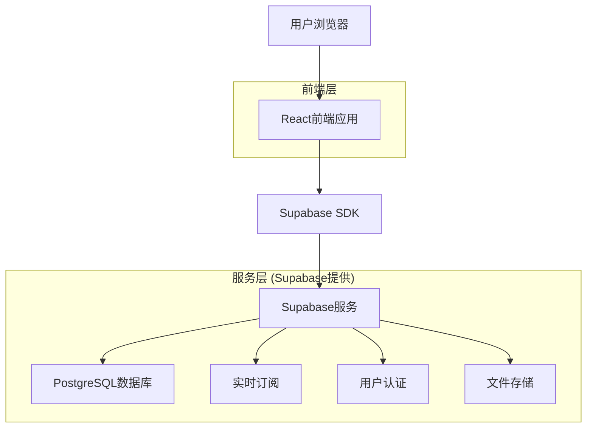
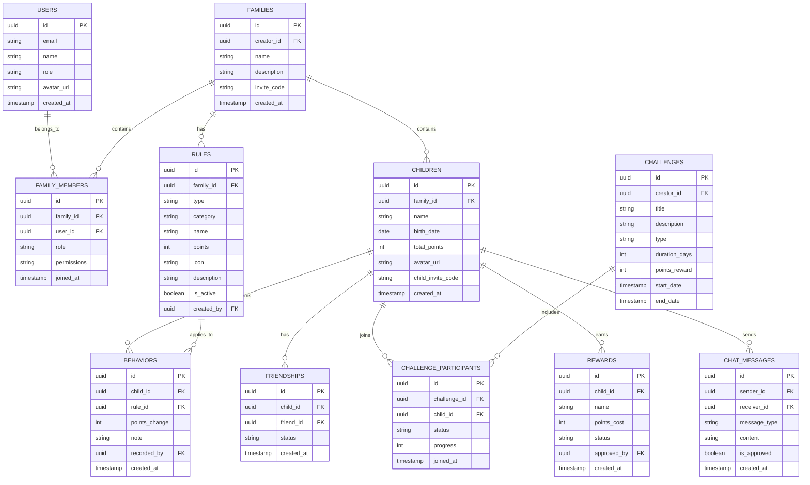

# 小星星成长记 - 技术架构文档

## 1. 架构设计



## 2. 技术描述

* 前端：React\@18 + TypeScript + TailwindCSS + Vite

* 后端：Supabase (PostgreSQL + 实时API + 认证)

* 状态管理：Zustand

* UI组件：Headless UI + 自定义组件

* 图表库：Chart.js

* 部署：Vercel

## 3. 路由定义

| 路由         | 用途               |
| ---------- | ---------------- |
| /          | 首页，显示积分概览、快速导航和好友动态   |
| /login     | 登录页面，支持手机号和邮箱登录  |
| /register  | 注册页面，创建家长账户      |
| /dashboard | 仪表板，家庭概览和数据统计    |
| /rules     | 规则管理页面，管理奖惩规则和家长协作    |
| /records   | 行为记录页面，记录和查看行为历史，支持分工记录 |
| /rewards   | 积分兑换页面，查看和兑换奖励   |
| /reports   | 统计报告页面，查看成长分析和家庭对比    |
| /community | 互动社区页面，儿童好友系统和成长挑战 |
| /collaborate | 家长协作页面，权限管理和任务分工 |
| /settings  | 设置页面，用户和系统设置，安全中心     |
| /family    | 家庭管理页面，管理家庭成员和邀请码    |

## 4. API定义

### 4.1 核心API

**用户认证相关**

```
POST /auth/signup
```

请求参数：

| 参数名      | 参数类型   | 是否必需 | 描述   |
| -------- | ------ | ---- | ---- |
| email    | string | true | 用户邮箱 |
| password | string | true | 用户密码 |
| name     | string | true | 用户姓名 |

响应参数：

| 参数名     | 参数类型   | 描述     |
| ------- | ------ | ------ |
| user    | object | 用户信息对象 |
| session | object | 会话信息   |

**规则管理相关**

```
POST /api/rules
GET /api/rules
PUT /api/rules/:id
DELETE /api/rules/:id
POST /api/rules/vote
GET /api/rules/discussions
```

**行为记录相关**

```
POST /api/behaviors
GET /api/behaviors
GET /api/behaviors/stats
POST /api/behaviors/assign
GET /api/behaviors/assignments
```

**家长协作相关**

```
POST /api/family/invite
POST /api/family/join
GET /api/family/members
PUT /api/family/permissions
POST /api/family/discussions
GET /api/family/tasks
```

**儿童互动相关**

```
POST /api/children/invite
POST /api/children/friends
GET /api/children/friends
POST /api/challenges
GET /api/challenges
POST /api/challenges/join
GET /api/leaderboard
```

**安全聊天相关**

```
POST /api/chat/send
GET /api/chat/messages
POST /api/chat/report
GET /api/chat/supervision
```

示例请求：

```json
{
  "email": "parent@example.com",
  "password": "securepassword",
  "name": "张爸爸"
}
```

## 5. 数据模型

### 5.1 数据模型定义



### 5.2 数据定义语言

**用户表 (users)**

```sql
-- 创建用户表
CREATE TABLE users (
    id UUID PRIMARY KEY DEFAULT gen_random_uuid(),
    email VARCHAR(255) UNIQUE NOT NULL,
    name VARCHAR(100) NOT NULL,
    role VARCHAR(20) DEFAULT 'parent' CHECK (role IN ('parent', 'child')),
    created_at TIMESTAMP WITH TIME ZONE DEFAULT NOW(),
    updated_at TIMESTAMP WITH TIME ZONE DEFAULT NOW()
);

-- 创建家庭表
CREATE TABLE families (
    id UUID PRIMARY KEY DEFAULT gen_random_uuid(),
    creator_id UUID REFERENCES users(id) ON DELETE CASCADE,
    name VARCHAR(100) NOT NULL,
    description TEXT,
    invite_code VARCHAR(10) UNIQUE NOT NULL,
    created_at TIMESTAMP WITH TIME ZONE DEFAULT NOW()
);

-- 创建家庭成员表
CREATE TABLE family_members (
    id UUID PRIMARY KEY DEFAULT gen_random_uuid(),
    family_id UUID REFERENCES families(id) ON DELETE CASCADE,
    user_id UUID REFERENCES users(id) ON DELETE CASCADE,
    role VARCHAR(20) DEFAULT 'member' CHECK (role IN ('admin', 'member', 'observer')),
    permissions TEXT[], -- 权限数组
    joined_at TIMESTAMP WITH TIME ZONE DEFAULT NOW()
);

-- 创建儿童表
CREATE TABLE children (
    id UUID PRIMARY KEY DEFAULT gen_random_uuid(),
    family_id UUID REFERENCES families(id) ON DELETE CASCADE,
    name VARCHAR(100) NOT NULL,
    birth_date DATE,
    total_points INTEGER DEFAULT 0,
    avatar_url VARCHAR(255),
    child_invite_code VARCHAR(8) UNIQUE,
    created_at TIMESTAMP WITH TIME ZONE DEFAULT NOW()
);

-- 创建好友关系表
CREATE TABLE friendships (
    id UUID PRIMARY KEY DEFAULT gen_random_uuid(),
    child_id UUID REFERENCES children(id) ON DELETE CASCADE,
    friend_id UUID REFERENCES children(id) ON DELETE CASCADE,
    status VARCHAR(20) DEFAULT 'pending' CHECK (status IN ('pending', 'approved', 'blocked')),
    created_at TIMESTAMP WITH TIME ZONE DEFAULT NOW(),
    UNIQUE(child_id, friend_id)
);

-- 创建挑战表
CREATE TABLE challenges (
    id UUID PRIMARY KEY DEFAULT gen_random_uuid(),
    creator_id UUID REFERENCES children(id) ON DELETE CASCADE,
    title VARCHAR(200) NOT NULL,
    description TEXT,
    type VARCHAR(20) CHECK (type IN ('habit', 'task', 'competition')),
    duration_days INTEGER DEFAULT 7,
    points_reward INTEGER DEFAULT 0,
    start_date TIMESTAMP WITH TIME ZONE DEFAULT NOW(),
    end_date TIMESTAMP WITH TIME ZONE,
    created_at TIMESTAMP WITH TIME ZONE DEFAULT NOW()
);

-- 创建挑战参与者表
CREATE TABLE challenge_participants (
    id UUID PRIMARY KEY DEFAULT gen_random_uuid(),
    challenge_id UUID REFERENCES challenges(id) ON DELETE CASCADE,
    child_id UUID REFERENCES children(id) ON DELETE CASCADE,
    status VARCHAR(20) DEFAULT 'active' CHECK (status IN ('active', 'completed', 'failed', 'quit')),
    progress INTEGER DEFAULT 0,
    joined_at TIMESTAMP WITH TIME ZONE DEFAULT NOW(),
    UNIQUE(challenge_id, child_id)
);

-- 创建聊天消息表
CREATE TABLE chat_messages (
    id UUID PRIMARY KEY DEFAULT gen_random_uuid(),
    sender_id UUID REFERENCES children(id) ON DELETE CASCADE,
    receiver_id UUID REFERENCES children(id) ON DELETE CASCADE,
    message_type VARCHAR(20) DEFAULT 'text' CHECK (message_type IN ('text', 'emoji', 'preset')),
    content TEXT NOT NULL,
    is_approved BOOLEAN DEFAULT false,
    created_at TIMESTAMP WITH TIME ZONE DEFAULT NOW()
);

-- 创建规则表
CREATE TABLE rules (
    id UUID PRIMARY KEY DEFAULT gen_random_uuid(),
    family_id UUID REFERENCES families(id) ON DELETE CASCADE,
    type VARCHAR(20) NOT NULL CHECK (type IN ('reward', 'punishment')),
    category VARCHAR(20) NOT NULL,
    name VARCHAR(200) NOT NULL,
    points INTEGER NOT NULL,
    icon VARCHAR(50),
    description TEXT,
    is_active BOOLEAN DEFAULT true,
    created_by UUID REFERENCES users(id),
    requires_approval BOOLEAN DEFAULT false,
    created_at TIMESTAMP WITH TIME ZONE DEFAULT NOW()
);

-- 创建行为记录表
CREATE TABLE behaviors (
    id UUID PRIMARY KEY DEFAULT gen_random_uuid(),
    child_id UUID REFERENCES children(id) ON DELETE CASCADE,
    rule_id UUID REFERENCES rules(id) ON DELETE CASCADE,
    points_change INTEGER NOT NULL,
    note TEXT,
    recorded_by UUID REFERENCES users(id),
    is_verified BOOLEAN DEFAULT false,
    verified_by UUID REFERENCES users(id),
    created_at TIMESTAMP WITH TIME ZONE DEFAULT NOW()
);

-- 创建奖励兑换表
CREATE TABLE rewards (
    id UUID PRIMARY KEY DEFAULT gen_random_uuid(),
    child_id UUID REFERENCES children(id) ON DELETE CASCADE,
    name VARCHAR(200) NOT NULL,
    points_cost INTEGER NOT NULL,
    status VARCHAR(20) DEFAULT 'pending' CHECK (status IN ('pending', 'approved', 'completed', 'rejected')),
    approved_by UUID REFERENCES users(id),
    approval_note TEXT,
    created_at TIMESTAMP WITH TIME ZONE DEFAULT NOW()
);

-- 创建索引
CREATE INDEX idx_behaviors_child_id ON behaviors(child_id);
CREATE INDEX idx_behaviors_created_at ON behaviors(created_at DESC);
CREATE INDEX idx_rules_family_id ON rules(family_id);
CREATE INDEX idx_children_family_id ON children(family_id);
CREATE INDEX idx_family_members_family_id ON family_members(family_id);
CREATE INDEX idx_family_members_user_id ON family_members(user_id);
CREATE INDEX idx_friendships_child_id ON friendships(child_id);
CREATE INDEX idx_friendships_friend_id ON friendships(friend_id);
CREATE INDEX idx_challenges_creator_id ON challenges(creator_id);
CREATE INDEX idx_challenge_participants_challenge_id ON challenge_participants(challenge_id);
CREATE INDEX idx_challenge_participants_child_id ON challenge_participants(child_id);
CREATE INDEX idx_chat_messages_sender_id ON chat_messages(sender_id);
CREATE INDEX idx_chat_messages_receiver_id ON chat_messages(receiver_id);
CREATE INDEX idx_chat_messages_created_at ON chat_messages(created_at DESC);

-- 设置RLS策略
ALTER TABLE families ENABLE ROW LEVEL SECURITY;
ALTER TABLE family_members ENABLE ROW LEVEL SECURITY;
ALTER TABLE children ENABLE ROW LEVEL SECURITY;
ALTER TABLE rules ENABLE ROW LEVEL SECURITY;
ALTER TABLE behaviors ENABLE ROW LEVEL SECURITY;
ALTER TABLE rewards ENABLE ROW LEVEL SECURITY;
ALTER TABLE friendships ENABLE ROW LEVEL SECURITY;
ALTER TABLE challenges ENABLE ROW LEVEL SECURITY;
ALTER TABLE challenge_participants ENABLE ROW LEVEL SECURITY;
ALTER TABLE chat_messages ENABLE ROW LEVEL SECURITY;

-- 基础权限设置
GRANT SELECT ON families TO anon;
GRANT ALL PRIVILEGES ON families TO authenticated;
GRANT SELECT ON family_members TO anon;
GRANT ALL PRIVILEGES ON family_members TO authenticated;
GRANT SELECT ON children TO anon;
GRANT ALL PRIVILEGES ON children TO authenticated;
GRANT SELECT ON rules TO anon;
GRANT ALL PRIVILEGES ON rules TO authenticated;
GRANT SELECT ON behaviors TO anon;
GRANT ALL PRIVILEGES ON behaviors TO authenticated;
GRANT SELECT ON rewards TO anon;
GRANT ALL PRIVILEGES ON rewards TO authenticated;
GRANT SELECT ON friendships TO anon;
GRANT ALL PRIVILEGES ON friendships TO authenticated;
GRANT SELECT ON challenges TO anon;
GRANT ALL PRIVILEGES ON challenges TO authenticated;
GRANT SELECT ON challenge_participants TO anon;
GRANT ALL PRIVILEGES ON challenge_participants TO authenticated;
GRANT SELECT ON chat_messages TO anon;
GRANT ALL PRIVILEGES ON chat_messages TO authenticated;

-- 初始化数据
INSERT INTO rules (family_id, type, category, name, points, icon, description, requires_approval) VALUES
('00000000-0000-0000-0000-000000000000', 'reward', 'daily', '自己吃饭', 2, '👶🥄', '不挑食、不浪费', false),
('00000000-0000-0000-0000-000000000000', 'reward', 'daily', '自己刷牙', 1, '🧸🪥', '早晚各一次、主动完成', false),
('00000000-0000-0000-0000-000000000000', 'punishment', 'minor', '不听话哭闹', -1, '👶🙅‍♂️❌', '任性、哭闹行为', true),
('00000000-0000-0000-0000-000000000000', 'punishment', 'serious', '危险行为', -10, '👶⚠️❌', '如爬高、玩火等', true),
(NULL, 'reward', 'study', '完成作业', 10, '📚', '按时完成当天的作业', false),
(NULL, 'reward', 'chores', '整理房间', 15, '🧹', '主动整理自己的房间', false),
(NULL, 'reward', 'behavior', '帮助他人', 20, '🤝', '主动帮助家人或朋友', false),
(NULL, 'punishment', 'behavior', '说谎', -20, '🤥', '对家人说谎或隐瞒事实', true),
(NULL, 'punishment', 'behavior', '不听话', -10, '😤', '不听从家长的合理要求', true);

-- 初始化挑战模板
INSERT INTO challenges (creator_id, title, description, type, duration_days, points_reward) VALUES
(NULL, '早起挑战', '连续7天早上7点前起床', 'habit', 7, 50),
(NULL, '阅读马拉松', '每天阅读30分钟，坚持一周', 'habit', 7, 70),
(NULL, '家务小能手', '每天完成一项家务，持续一周', 'task', 7, 60),
(NULL, '运动达人', '每天运动30分钟，坚持一周', 'habit', 7, 80);

-- 预设安全聊天消息
CREATE TABLE preset_messages (
    id UUID PRIMARY KEY DEFAULT gen_random_uuid(),
    category VARCHAR(50) NOT NULL,
    content TEXT NOT NULL,
    emoji VARCHAR(10)
);

INSERT INTO preset_messages (category, content, emoji) VALUES
('encouragement', '你真棒！', '👍'),
('encouragement', '加油！', '💪'),
('encouragement', '继续努力！', '🌟'),
('greeting', '你好！', '👋'),
('greeting', '早上好！', '🌅'),
('greeting', '晚安！', '🌙'),
('celebration', '恭喜你！', '🎉'),
('celebration', '太厉害了！', '🏆'),
('support', '我支持你！', '🤗'),
('support', '我们一起加油！', '👫');
```

