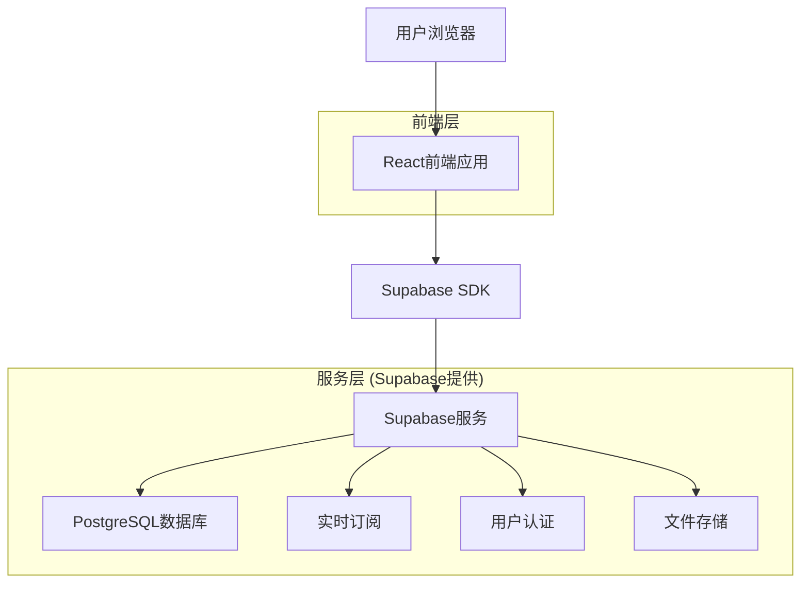
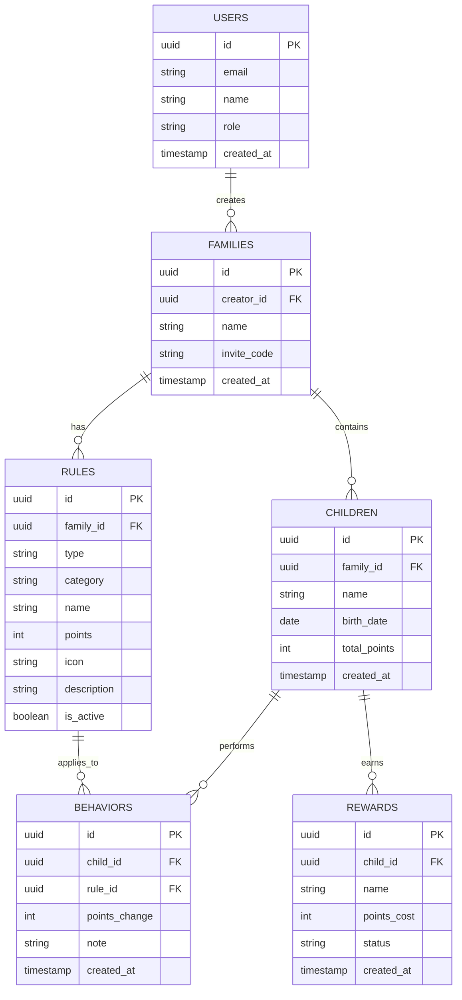

# 小星星成长记 - 技术架构文档

## 1. 架构设计



## 2. 技术描述

* 前端：React\@18 + TypeScript + TailwindCSS + Vite

* 后端：Supabase (PostgreSQL + 实时API + 认证)

* 状态管理：Zustand

* UI组件：Headless UI + 自定义组件

* 图表库：Chart.js

* 部署：Vercel

## 3. 路由定义

| 路由         | 用途               |
| ---------- | ---------------- |
| /          | 首页，显示积分概览和快速导航   |
| /login     | 登录页面，支持手机号和邮箱登录  |
| /register  | 注册页面，创建家长账户      |
| /dashboard | 仪表板，家庭概览和数据统计    |
| /rules     | 规则管理页面，管理奖惩规则    |
| /records   | 行为记录页面，记录和查看行为历史 |
| /rewards   | 积分兑换页面，查看和兑换奖励   |
| /reports   | 统计报告页面，查看成长分析    |
| /settings  | 设置页面，用户和系统设置     |
| /family    | 家庭管理页面，管理家庭成员    |

## 4. API定义

### 4.1 核心API

**用户认证相关**

```
POST /auth/signup
```

请求参数：

| 参数名      | 参数类型   | 是否必需 | 描述   |
| -------- | ------ | ---- | ---- |
| email    | string | true | 用户邮箱 |
| password | string | true | 用户密码 |
| name     | string | true | 用户姓名 |

响应参数：

| 参数名     | 参数类型   | 描述     |
| ------- | ------ | ------ |
| user    | object | 用户信息对象 |
| session | object | 会话信息   |

**规则管理相关**

```
POST /api/rules
GET /api/rules
PUT /api/rules/:id
DELETE /api/rules/:id
```

**行为记录相关**

```
POST /api/behaviors
GET /api/behaviors
GET /api/behaviors/stats
```

示例请求：

```json
{
  "email": "parent@example.com",
  "password": "securepassword",
  "name": "张爸爸"
}
```

## 5. 数据模型

### 5.1 数据模型定义



### 5.2 数据定义语言

**用户表 (users)**

```sql
-- 创建用户表
CREATE TABLE users (
    id UUID PRIMARY KEY DEFAULT gen_random_uuid(),
    email VARCHAR(255) UNIQUE NOT NULL,
    name VARCHAR(100) NOT NULL,
    role VARCHAR(20) DEFAULT 'parent' CHECK (role IN ('parent', 'child')),
    created_at TIMESTAMP WITH TIME ZONE DEFAULT NOW(),
    updated_at TIMESTAMP WITH TIME ZONE DEFAULT NOW()
);

-- 创建家庭表
CREATE TABLE families (
    id UUID PRIMARY KEY DEFAULT gen_random_uuid(),
    creator_id UUID REFERENCES users(id) ON DELETE CASCADE,
    name VARCHAR(100) NOT NULL,
    invite_code VARCHAR(10) UNIQUE NOT NULL,
    created_at TIMESTAMP WITH TIME ZONE DEFAULT NOW()
);

-- 创建儿童表
CREATE TABLE children (
    id UUID PRIMARY KEY DEFAULT gen_random_uuid(),
    family_id UUID REFERENCES families(id) ON DELETE CASCADE,
    name VARCHAR(100) NOT NULL,
    birth_date DATE,
    total_points INTEGER DEFAULT 0,
    created_at TIMESTAMP WITH TIME ZONE DEFAULT NOW()
);

-- 创建规则表
CREATE TABLE rules (
    id UUID PRIMARY KEY DEFAULT gen_random_uuid(),
    family_id UUID REFERENCES families(id) ON DELETE CASCADE,
    type VARCHAR(20) NOT NULL CHECK (type IN ('reward', 'punishment')),
    category VARCHAR(20) NOT NULL,
    name VARCHAR(200) NOT NULL,
    points INTEGER NOT NULL,
    icon VARCHAR(50),
    description TEXT,
    is_active BOOLEAN DEFAULT true,
    created_at TIMESTAMP WITH TIME ZONE DEFAULT NOW()
);

-- 创建行为记录表
CREATE TABLE behaviors (
    id UUID PRIMARY KEY DEFAULT gen_random_uuid(),
    child_id UUID REFERENCES children(id) ON DELETE CASCADE,
    rule_id UUID REFERENCES rules(id) ON DELETE CASCADE,
    points_change INTEGER NOT NULL,
    note TEXT,
    created_at TIMESTAMP WITH TIME ZONE DEFAULT NOW()
);

-- 创建奖励兑换表
CREATE TABLE rewards (
    id UUID PRIMARY KEY DEFAULT gen_random_uuid(),
    child_id UUID REFERENCES children(id) ON DELETE CASCADE,
    name VARCHAR(200) NOT NULL,
    points_cost INTEGER NOT NULL,
    status VARCHAR(20) DEFAULT 'pending' CHECK (status IN ('pending', 'approved', 'completed')),
    created_at TIMESTAMP WITH TIME ZONE DEFAULT NOW()
);

-- 创建索引
CREATE INDEX idx_behaviors_child_id ON behaviors(child_id);
CREATE INDEX idx_behaviors_created_at ON behaviors(created_at DESC);
CREATE INDEX idx_rules_family_id ON rules(family_id);
CREATE INDEX idx_children_family_id ON children(family_id);

-- 设置RLS策略
ALTER TABLE families ENABLE ROW LEVEL SECURITY;
ALTER TABLE children ENABLE ROW LEVEL SECURITY;
ALTER TABLE rules ENABLE ROW LEVEL SECURITY;
ALTER TABLE behaviors ENABLE ROW LEVEL SECURITY;
ALTER TABLE rewards ENABLE ROW LEVEL SECURITY;

-- 基础权限设置
GRANT SELECT ON families TO anon;
GRANT ALL PRIVILEGES ON families TO authenticated;
GRANT ALL PRIVILEGES ON children TO authenticated;
GRANT ALL PRIVILEGES ON rules TO authenticated;
GRANT ALL PRIVILEGES ON behaviors TO authenticated;
GRANT ALL PRIVILEGES ON rewards TO authenticated;

-- 初始化数据
INSERT INTO rules (family_id, type, category, name, points, icon, description) VALUES
('00000000-0000-0000-0000-000000000000', 'reward', 'daily', '自己吃饭', 2, '👶🥄', '不挑食、不浪费'),
('00000000-0000-0000-0000-000000000000', 'reward', 'daily', '自己刷牙', 1, '🧸🪥', '早晚各一次、主动完成'),
('00000000-0000-0000-0000-000000000000', 'punishment', 'minor', '不听话哭闹', -1, '👶🙅‍♂️❌', '任性、哭闹行为'),
('00000000-0000-0000-0000-000000000000', 'punishment', 'serious', '危险行为', -10, '👶⚠️❌', '如爬高、玩火等');
```

